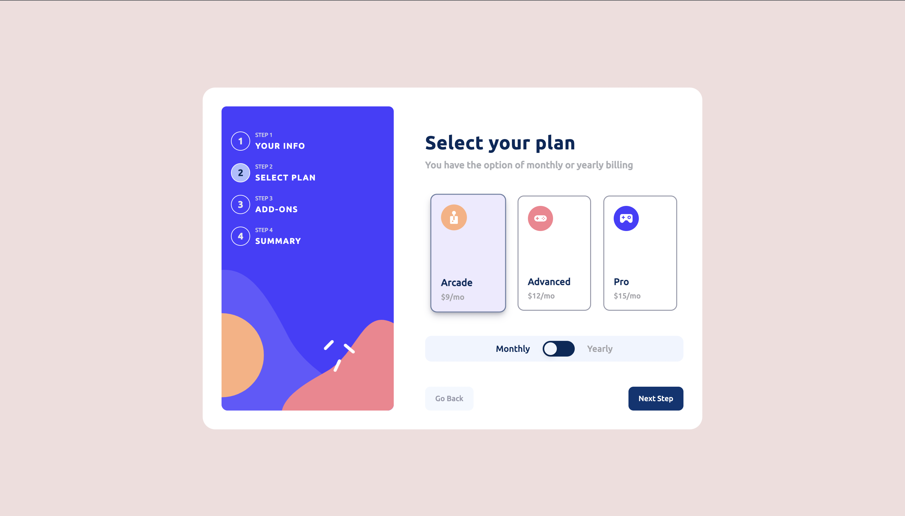
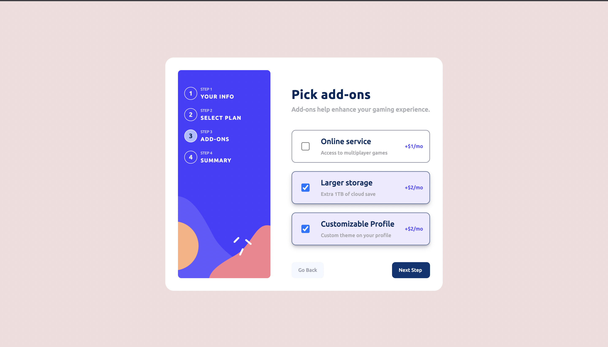
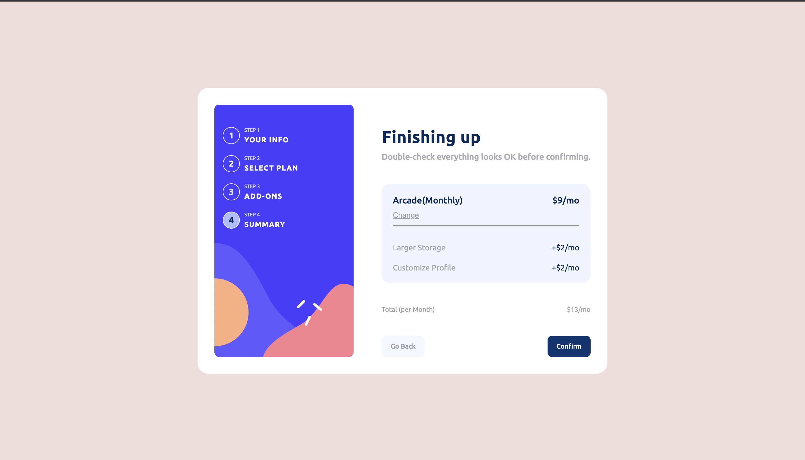
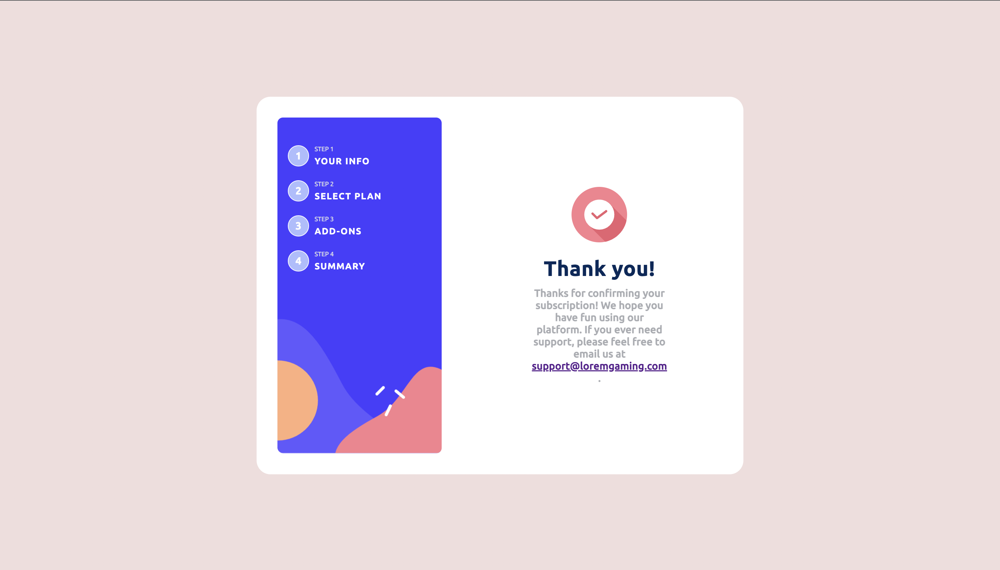

# Frontend Mentor - Multi-step form solution

This is a solution to the [Multi-step form challenge on Frontend Mentor](https://www.frontendmentor.io/challenges/multistep-form-YVAnSdqQBJ). Frontend Mentor challenges help you improve your coding skills by building realistic projects. 

## Table of contents

- [Overview](#overview)
  - [The challenge](#the-challenge)
  - [Screenshot](#screenshot)
  - [Links](#links)
  - [Built with](#built-with)
  - [What I learned](#what-i-learned)
  - [Useful resources](#useful-resources)
- [Author](#author)

## Overview
The following Project is a Multi-Step Form which has been created using HTML,CSS and JAVASCRIPT.This form uses various kinds of validations and other checks for every input.It has also been made dynamic by the use of JS as a Summary of a cart is displayed on the 4th page.

### The challenge

Users should be able to:

- Complete each step of the sequence
- Go back to a previous step to update their selections
- See a summary of their selections on the final step and confirm their order
- View the optimal layout for the interface depending on their device's screen size
- See hover and focus states for all interactive elements on the page
- Receive form validation messages if:
  - A field has been missed
  - The email address is not formatted correctly
  - A step is submitted, but no selection has been made

### Screenshot

### Links

- Solution URL: [https://github.com/Divjas-Singh/Multi-step-form/](https://github.com/Divjas-Singh/Multi-step-form/)
- Live Site URL: [https://divjas-singh.github.io/Multi-step-form/](https://divjas-singh.github.io/Multi-step-form/)

### Built with

- Semantic HTML5 markup
- CSS custom properties
- Flexbox
- CSS Grid
- Mobile-first workflow
- [Styled Components](https://styled-components.com/) - For styles
- media Queries

### What I learned

During this project I learned more about project workflow and also using function instead of directly declaring actions in javascript.

### Useful resources

- [https://neumorphism.io/](https://neumorphism.io/) - This helped me in creating neat and aesthetic buttons easily. 
- [https://regexr.com/](https://regexr.com/) - This is an amazing site which helped me finally understanding and implementing Regular Expressions for form validation. I'd recommend it to anyone still learning this concept.

## Author
- Frontend Mentor - [@Divjas-Singh](https://www.frontendmentor.io/profile/Divjas-Singh)
